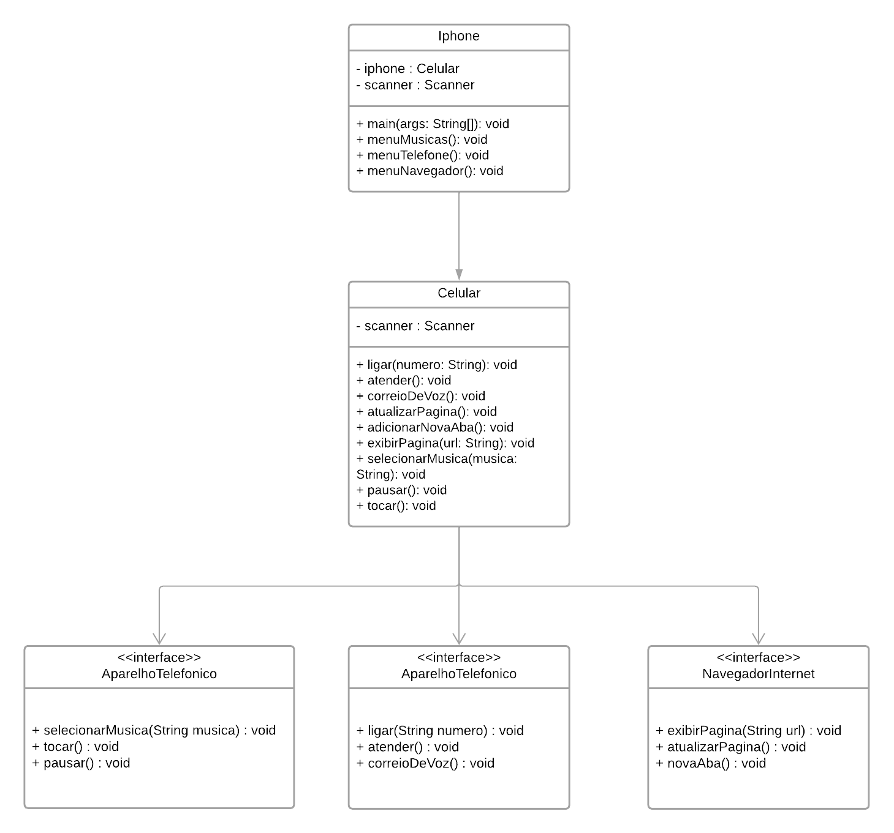

# Bem vindo ao projeto Iphone

Um projeto desenvolvido por meio da linguagem Java. Faz parte de uma atividade do bootcamp "Desenvolvimento Java com IA", da DIO. O projeto tem como finalidade treinar as habilidades adquiridas sobre interfaces, classes abstratas, encapsulamento de dados, UML etc.

# Arquivos
 
